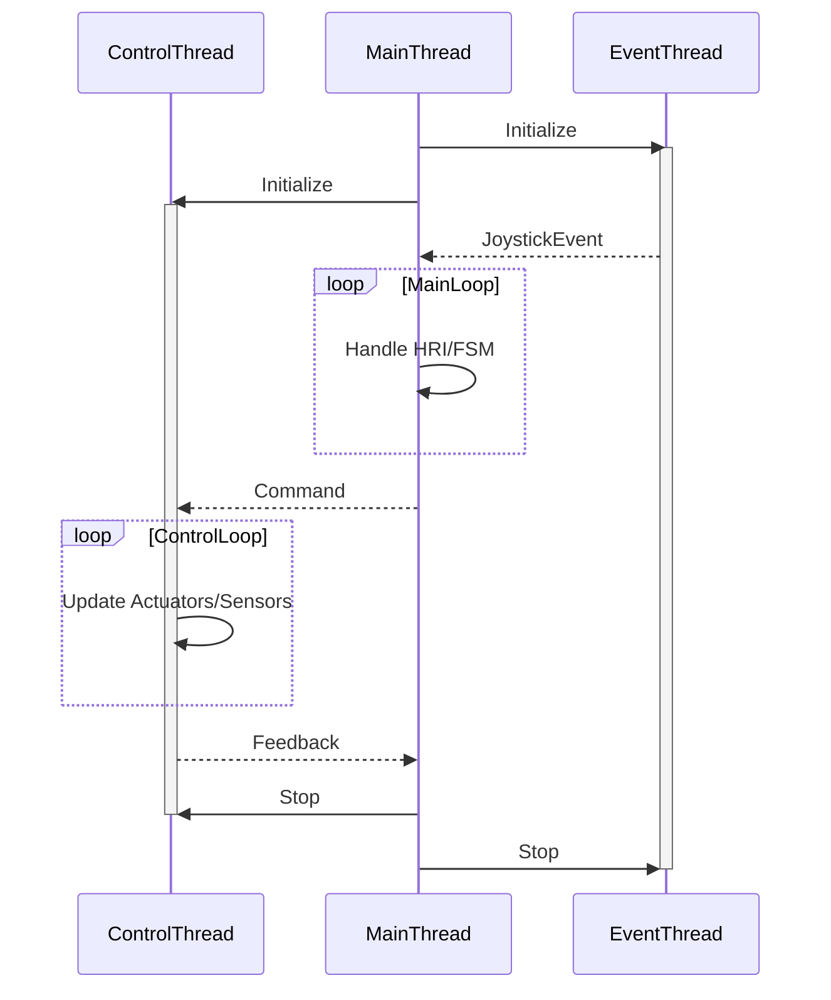

# Swerve-drive Robot

## SBot Controller Application

The SBot Controller is a motion controller for the WsSbotBase, a custom-built robot with WaveShare servos and motors.
The application initializes the SbotSystem and keeps it running until the user stops the application. 

